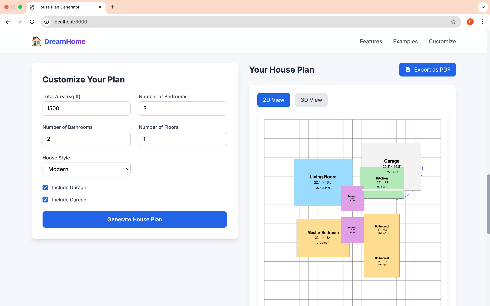
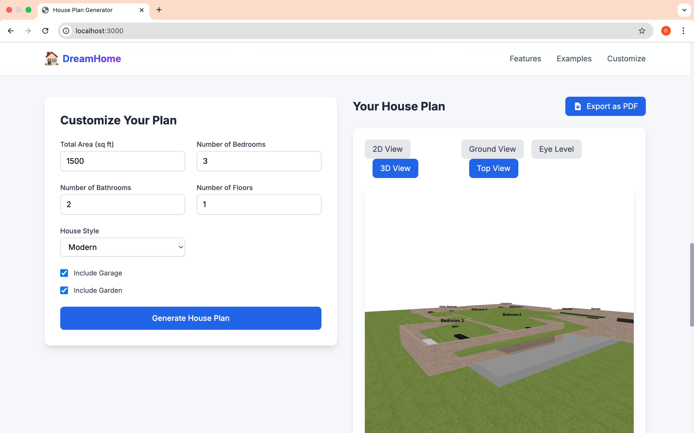

📌 House Planner 2D/3D

🚀 House Planner 2D/3D is a Next.js application that allows users to input their house plan details and generates 2D & 3D designs. Users can also download the design as a PDF for reference.

🌟 Features
✅ User Input Based House Planning – Enter house dimensions, rooms, and layouts.
✅ 2D & 3D Visualization – View designs in both 2D & 3D.
✅ PDF Export – Download the generated house plan as a PDF file.
✅ Fast & Optimized – Built using Next.js for high performance.
✅ Responsive & User-friendly – Works across all devices.

🚀 Getting Started
1️⃣ Install Dependencies

git clone https://github.com/your-username/house-planner-2d-3d.git
cd house-planner-2d-3d
npm install  # or yarn install
2️⃣ Run the Development Server

npm run dev  # or yarn dev
➡ Open http://localhost:3000 in your browser.

🛠️ Technologies Used
Next.js – React framework for SSR & performance
Three.js – For 3D visualization
Fabric.js – For 2D rendering
html2pdf.js – Converts designs to PDF
Tailwind CSS – Modern & responsive UI styling
📸 Screenshots
(public/Screenshot1.png)
(public/Screenshot2.png)
(public/Screenshot3.png)

### 🏠 **2D House Plan**

### 🏠 **3D House Design**

📄 API & Data Flow
1️⃣ User Inputs House Dimensions & Layout
2️⃣ System Processes & Generates 2D Plan using Fabric.js
3️⃣ 3D Model is Rendered using Three.js
4️⃣ User Can Download Plan as PDF

🚀 Deployment
Easily deploy this project on Vercel:

💡 Contributing
🙌 Contributions are always welcome!

Fork this repository
Create a branch (git checkout -b feature-xyz)
Commit changes (git commit -m "Added new feature")
Push to branch (git push origin feature-xyz)
Open a Pull Request
📜 License
📝 This project is open-source and available under the MIT License.

Would you like me to generate sample 2D/3D house designs for the public/ folder to be used in the README? 🚀